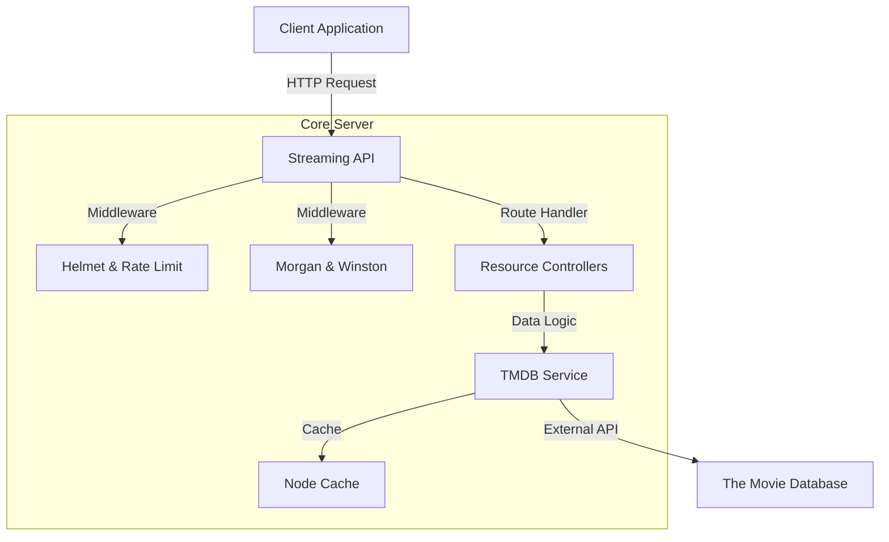

# Streaming-API

[](https://nodejs.org)
[](https://expressjs.com)
[](LICENSE)
[](tests/)

Enterprise-grade REST API for real-time media data aggregation. Built with Node.js, featuring high-performance caching, advanced content discovery, global localization, and comprehensive security. This application leverages The Movie Database (TMDB) API to provide exhaustive metadata for movies, TV shows, and personnel.

## System Overview

The Streaming API serves as a middle-layer between client applications and the TMDB service, providing cached, formatted, and secured media data.



## Core Features

- **Enterprise Logging:** Structured logging using Winston and HTTP request logging with Morgan.
- **Enhanced Security:** Implementation of Helmet.js for HTTP header security and built-in rate limiting.
- **External Metadata:** Integration of external IDs (IMDb, WikiData, etc.) for movies, TV shows, and people.
- **Global Localization:** Multi-language support via query parameters.
- **Watch Providers:** Real-time data on streaming availability across platforms.
- **Automated Testing:** Integration testing suite powered by Jest and Supertest.
- **Performance:** Optimized with in-memory caching to reduce external API latency.

## Getting Started

### Prerequisites

- Node.js v18+
- npm or yarn
- TMDB API Key

### Installation

1.  **Clone the repository**
    ```bash
    git clone https://github.com/ramkrishna-js/Streaming-API.git
    cd Streaming-API
    ```

2.  **Install dependencies**
    ```bash
    npm install
    ```

3.  **Environment Setup**
    ```bash
    cp .env.example .env
    ```
    Configure your `TMDB_API_KEY` in the `.env` file.

4.  **Running the Application**
    ```bash
    # Start production server
    npm start

    # Start development server with hot reload
    npm run dev
    ```

5.  **Running Tests**
    ```bash
    npm test
    ```

## API Documentation

All resource endpoints support an optional `language` parameter. Detailed IDs for IMDb and social platforms are included in the resource detail responses.

| Category | Endpoint | Purpose |
|----------|----------|---------|
| Movies | `/api/movies/discover` | Advanced search and discovery |
| TV Shows | `/api/tv/{id}/season/{s}` | Specific season metadata |
| People | `/api/people/{id}` | Profile, credits, and social links |
| Search | `/api/search/multi` | Global search across categories |
| System | `/health` | API heartbeat and status |

## Contributing

Please submit a pull request for any feature enhancements or bug fixes. Ensure that new code includes appropriate tests and adheres to the established logging standards.

## License

This project is licensed under the MIT License.

---

<p align="center">
  Developed by <a href="https://github.com/ramkrishna-js">ramkrishna-js</a>
</p>
