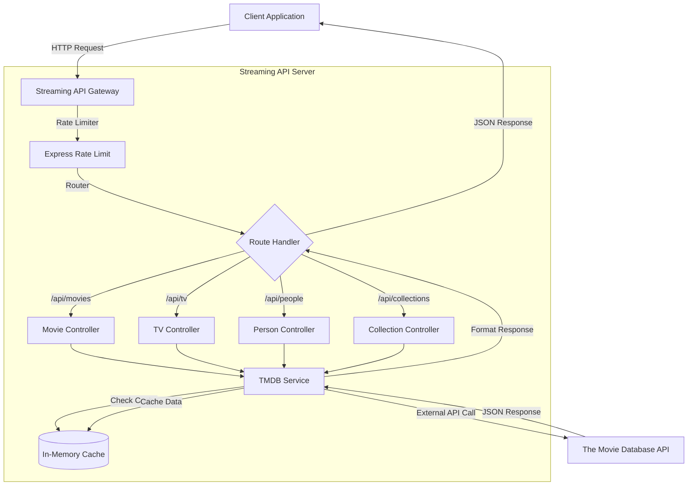
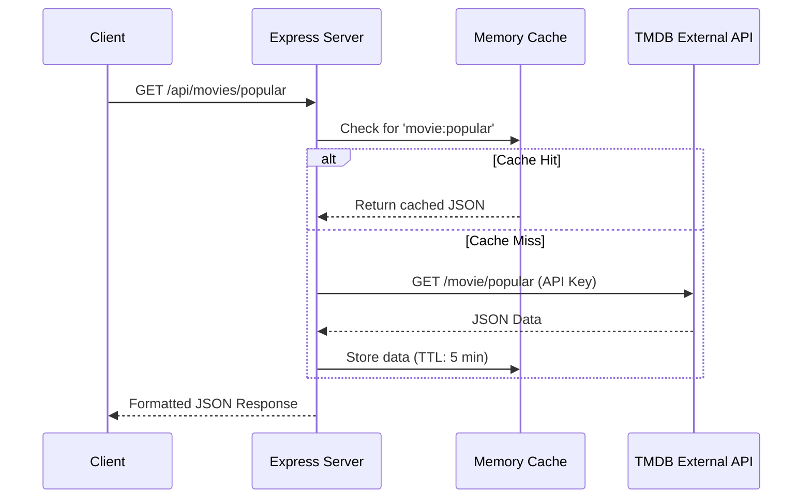

# Streaming-API

[](https://nodejs.org)
[](https://expressjs.com)
[](LICENSE)

A robust, enterprise-grade REST API designed for real-time media data aggregation and delivery. This application leverages The Movie Database (TMDB) API to provide comprehensive information for movies, TV shows, and personnel.

## System Architecture

The following diagram illustrates the high-level architecture of the Streaming API, showcasing the data flow from the client to the TMDB external service.



## Key Features

- **Advanced Discovery:** Filter content by year, rating, genre, and more with granular control.
- **Global Localization:** Full support for internationalization via the `language` query parameter (e.g., `es-ES`, `fr-FR`).
- **Watch Providers:** Real-time streaming availability data (Netflix, Amazon Prime, etc.).
- **Comprehensive Media Data:**
    - **Movies:** Now Playing, Popular, Top Rated, Reviews, Similar items.
    - **TV Shows:** Season & Episode details, On The Air, Airing Today.
    - **People:** Cast profiles, credits, and trending personalities.
- **Collections:** Dedicated endpoints for movie franchises and collections.
- **Multi-Search:** Unified search across all media types.
- **Performance:** Implemented with in-memory caching and rate limiting for optimal reliability.

## Getting Started

### Prerequisites

- Node.js v18 or higher
- npm or yarn
- A valid [TMDB API Key](https://www.themoviedb.org/documentation/api)

### Installation

1.  **Clone the repository**
    ```bash
    git clone https://github.com/ramkrishna-js/Streaming-API.git
    cd Streaming-API
    ```

2.  **Install dependencies**
    ```bash
    npm install
    ```

3.  **Environment Setup**
    Create a `.env` file in the root directory:
    ```bash
    cp .env.example .env
    ```
    Update the `.env` file with your credentials:
    ```env
    TMDB_API_KEY=your_actual_api_key
    PORT=3000
    NODE_ENV=development
    ```

4.  **Start the Application**
    ```bash
    npm start
    ```
    The server will initialize at `http://localhost:3000`.

## API Request Flow

The sequence diagram below details the lifecycle of a typical API request, including caching strategies.



## API Reference

All endpoints accept an optional `language` query parameter (default: `en-US`).

### Movies
| Method | Endpoint | Description |
|--------|----------|-------------|
| GET | `/api/movies/search?q={query}` | Search by title |
| GET | `/api/movies/discover` | Advanced filtering (sort, year, rating) |
| GET | `/api/movies/{id}` | Detailed movie information |
| GET | `/api/movies/{id}/providers` | Streaming availability |
| GET | `/api/movies/popular/list` | Popular movies |
| GET | `/api/movies/now_playing/list` | Currently in theaters |
| GET | `/api/movies/top_rated/list` | Highest rated movies |

### TV Shows
| Method | Endpoint | Description |
|--------|----------|-------------|
| GET | `/api/tv/search?q={query}` | Search TV shows |
| GET | `/api/tv/discover` | Advanced filtering |
| GET | `/api/tv/{id}` | Show details |
| GET | `/api/tv/{id}/season/{s}` | Season details |
| GET | `/api/tv/{id}/season/{s}/episode/{e}` | Episode details |

### People
| Method | Endpoint | Description |
|--------|----------|-------------|
| GET | `/api/people/search?q={query}` | Search for people |
| GET | `/api/people/{id}` | Person details and credits |

### Collections
| Method | Endpoint | Description |
|--------|----------|-------------|
| GET | `/api/collections/{id}` | Collection details |

### General
| Method | Endpoint | Description |
|--------|----------|-------------|
| GET | `/api/search/multi?q={query}` | Combined search |
| GET | `/health` | System status check |

## Contributing

Contributions are welcome. Please fork the repository and submit a pull request for review.

## License

This project is licensed under the MIT License. See the [LICENSE](LICENSE) file for details.

---

<p align="center">
  Developed by <a href="https://github.com/ramkrishna-js">ramkrishna-js</a>
</p>